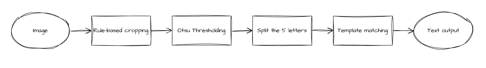
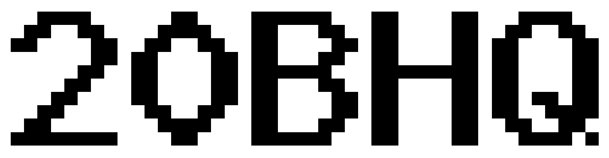
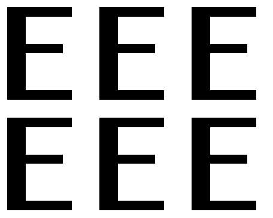
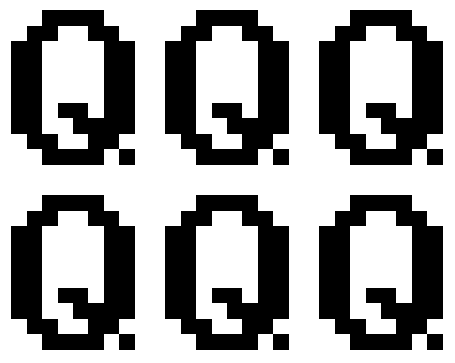
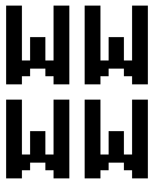

## Captcha Recognition
### Usage
```
from captcha import Captcha
captcha_reader = Captcha()
output = captcha_reader(im_path, save_path)
```
Requirements : OpenCV, Numpy
### Template preparation (optional)
To update the templates used in template matching with a different random seed, run on command line 
```
$ python template_creation.py --input_path PATH_TO_"sampleCaptchas" --seed 0
```
The script will 
* randomly split the samples into training/testing, while ensuring all the characters (`A-Z`, `0-9`) appear in the training samples for at least once.
* save the split to `templates/train_test_split.json`.
* save all the templates to `templates` folder in PNG format.
### Pipeline
    

#### Rule-based cropping
As the placement of the characters are fixed, the image is first cropped to exclude the irrelevant areas.
#### Otsu thresholding
Otsu algorithm is then applied to convert the image to binary. 
    
#### Split the letters 
We make use of the fact that all characters are 8 pixels wide and separated by 1 pixel to split the image into letters.
#### Template matching


It is observed that:
* Many of the characters appeared in the dataset for only once or twice. 

Character|Frequency|Character|Frequency|Character|Frequency|Character|Frequency|Character|Frequency|Character|Frequency
---|---|---|---|---|---|---|---|---|---|---|---
8|1|P|1|N|1|F|1|I|2|X|2
0|2|4|2|T|2|3|2|U|2|5|3
J|3|6|3|R|3|K|3|L|3|Y|3
S|4|H|4|7|4|W|4|A|4|B|4
9|5|Z|5|2|5|D|5|C|5|G|5
M|6|O|6|1|6|Q|6|E|6|V|7

* After the preprocessing, the characters are always the same across the different captcha samples. 

"E"|"Q"|"W"
---|---|---
||

Based on these observations, we believe any machine learning-based approach would have similar results, hence we just used the most straightforward one, i.e. template matching for character recognition.

### Performance

Dataset|# of character|Accuracy per character|# of sample|Accuracy per sample
---|---|---|---|---
Overall|130|100.00%|26|100.00%
Test|65|100.00%|13|100.00%
    
Run on command line to get the results above
```
$ python captcha.py --input_path PATH_TO_"sampleCaptchas" 
```

### Clip performance
We also tested another approach, in which zero-shot learning & feature matching (with  [CLIP ViT-B/32](https://github.com/openai/CLIP)) were used in replacement of template matching to recognize the characters.

**Zero-shot**
Dataset|# of character|Accuracy per character|# of sample|Accuracy per sample
---|---|---|---|---
Overall|130|80.77%|26|34.62%
Test|65|81.54%|13|46.15%

**Feature matching**
Dataset|# of character|Accuracy per character|# of sample|Accuracy per sample
---|---|---|---|---
Overall|130|100.00%|26|100.00%
Test|65|100.00%|13|100.00%

The outcomes of zero-shot learning are clearly less effective compared to template matching, while feature matching will deliver the same performance. Nonetheless, the method remains worth considering, particularly in scenarios where more variations are introduced to the samples, as it is likely to be more robust, even with a very limited sample size.